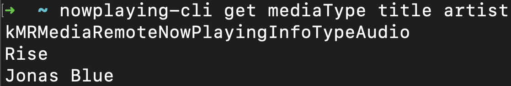
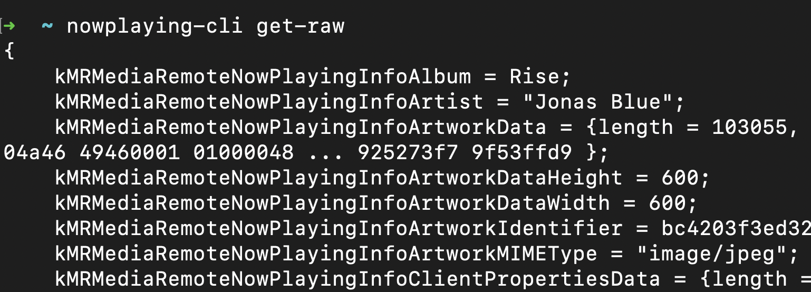

# nowplaying-cli
nowplaying-cli is a macOS command-line utility for retrieving currently playing media.

**Disclaimer:** nowplaying-cli uses private frameworks, which may cause it to break with future macOS software updates.

**Tested (and working) on:** 
- Ventura 13.1

## Usage
Get individual properties:

Get all available information:

## Available properties
| native  |  nowplaying-cli |
|---|---|
| kMRMediaRemoteNowPlayingInfoTotalDiscCount | totalDiscCount |
|  kMRMediaRemoteNowPlayingInfoShuffleMode | shuffleMode
|  kMRMediaRemoteNowPlayingInfoTrackNumber | trackNumber
|  kMRMediaRemoteNowPlayingInfoDuration | duration
|  kMRMediaRemoteNowPlayingInfoRepeatMode | repeatMode
|  kMRMediaRemoteNowPlayingInfoTitle | title
|  kMRMediaRemoteNowPlayingInfoPlaybackRate | playbackRate | 
|  kMRMediaRemoteNowPlayingInfoArtworkData | artworkData |
|  kMRMediaRemoteNowPlayingInfoAlbum | album |
|  kMRMediaRemoteNowPlayingInfoTotalQueueCount | totalQueueCount | 
|  kMRMediaRemoteNowPlayingInfoArtworkMIMEType | artworkMIMEType
|  kMRMediaRemoteNowPlayingInfoMediaType | mediaType |
|  kMRMediaRemoteNowPlayingInfoDiscNumber | discNumber |
|  kMRMediaRemoteNowPlayingInfoTimestamp | timestamp |
|  kMRMediaRemoteNowPlayingInfoGenre | genre |
|  kMRMediaRemoteNowPlayingInfoQueueIndex | queueIndex |
|  kMRMediaRemoteNowPlayingInfoArtist | artist |
|  kMRMediaRemoteNowPlayingInfoDefaultPlaybackRate | defaultPlaybackRate |
|  kMRMediaRemoteNowPlayingInfoElapsedTime | elapsedTime |
|  kMRMediaRemoteNowPlayingInfoTotalTrackCount | totalTrackCount |
|  kMRMediaRemoteNowPlayingInfoIsMusicApp | isMusicApp |
|  kMRMediaRemoteNowPlayingInfoUniqueIdentifier | uniqueIdentifier |

## Homebrew Install

## Releases

## Build
`clang nowplaying.mm -framework Cocoa -o nowplaying-cli`
