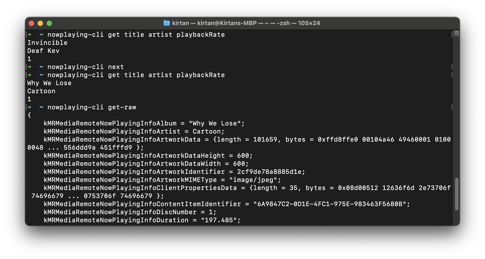

# nowplaying-cli
nowplaying-cli is a macOS command-line utility for retrieving currently playing media, and simulating media actions.

Use nowplaying-cli to get song information and play/pause your media through an easy to use CLI!

**Disclaimer:** nowplaying-cli uses private frameworks, which may cause it to break with future macOS software updates.

**Tested and working on:** 
- Ventura 13.1, 13.2, 13.3, 13.6
- Sonoma 14.4

## Installation

### Homebrew

You can install nowplaying-cli using [Homebrew](https://brew.sh/).
```bash
brew install nowplaying-cli
```

### Build from source

Clone the repository and run `make` to build the binary. You can then move the binary to your desired location.
```bash
make
mv nowplaying-cli ~/.local/bin
```

## Usage
`nowplaying-cli <cmd>`
| command | description |
| --- | --- |
| get [propName1 propName2 ... ] | get now playing media properties | 
| get-raw | get all non-nil now playing media properties in dictionary format |
| play | play the currently playing media regardless of current state |
| pause | pause the currently playing media regardless of current state |
| togglePlayPause | toggle play/pause based on current state |
| seek <seconds> | seek to a specific time in the currently playing media |
| skip <seconds> | skip forward or rewind track |
| next | skip to next track | 
| previous | go to previous track |

## Examples


## Available properties
| native  |  nowplaying-cli |
|---|---|
| kMRMediaRemoteNowPlayingInfoTotalDiscCount | totalDiscCount |
|  kMRMediaRemoteNowPlayingInfoShuffleMode | shuffleMode
|  kMRMediaRemoteNowPlayingInfoTrackNumber | trackNumber
|  kMRMediaRemoteNowPlayingInfoDuration | duration
|  kMRMediaRemoteNowPlayingInfoRepeatMode | repeatMode
|  kMRMediaRemoteNowPlayingInfoTitle | title
|  kMRMediaRemoteNowPlayingInfoPlaybackRate | playbackRate | 
|  kMRMediaRemoteNowPlayingInfoArtworkData | artworkData |
|  kMRMediaRemoteNowPlayingInfoArtworkDataWidth | artworkDataWidth |
|  kMRMediaRemoteNowPlayingInfoArtworkDataHeight | artworkDataHeight |
|  kMRMediaRemoteNowPlayingInfoAlbum | album |
|  kMRMediaRemoteNowPlayingInfoTotalQueueCount | totalQueueCount | 
|  kMRMediaRemoteNowPlayingInfoArtworkMIMEType | artworkMIMEType
|  kMRMediaRemoteNowPlayingInfoMediaType | mediaType |
|  kMRMediaRemoteNowPlayingInfoDiscNumber | discNumber |
|  kMRMediaRemoteNowPlayingInfoTimestamp | timestamp |
|  kMRMediaRemoteNowPlayingInfoGenre | genre |
|  kMRMediaRemoteNowPlayingInfoQueueIndex | queueIndex |
|  kMRMediaRemoteNowPlayingInfoArtist | artist |
|  kMRMediaRemoteNowPlayingInfoDefaultPlaybackRate | defaultPlaybackRate |
|  kMRMediaRemoteNowPlayingInfoElapsedTime | elapsedTime |
|  kMRMediaRemoteNowPlayingInfoTotalTrackCount | totalTrackCount |
|  kMRMediaRemoteNowPlayingInfoIsMusicApp | isMusicApp |
|  kMRMediaRemoteNowPlayingInfoUniqueIdentifier | uniqueIdentifier |
